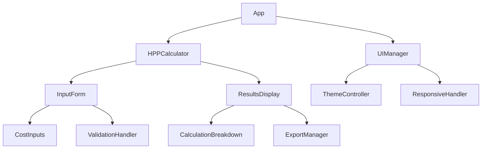
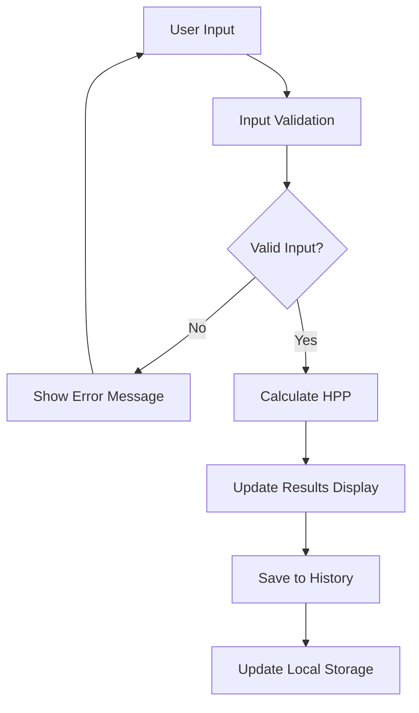

# HPP Calculator Website - Design Document

## Overview

The HPP (Harga Pokok Penjualan) Calculator is a modern, user-friendly web application designed to help users of all ages calculate the Cost of Goods Sold for their products. The application will be built using vanilla HTML, CSS, and JavaScript to ensure simplicity, performance, and broad compatibility.

### Key Features
- Simple and intuitive interface suitable for all age groups
- Real-time HPP calculation with multiple cost components
- Modern, responsive design that works on all devices
- Educational tooltips and guidance for new users
- Data persistence using local storage
- Export functionality for calculated results

## Technology Stack & Dependencies

### Core Technologies
- **HTML5**: Semantic markup for accessibility and SEO
- **CSS3**: Modern styling with CSS Grid and Flexbox
- **Vanilla JavaScript**: Pure JavaScript without frameworks for optimal performance

### Browser Support
- Chrome 80+
- Firefox 75+
- Safari 13+
- Edge 80+

### External Dependencies
- Font Awesome (for icons)
- Google Fonts (for typography)

## Component Architecture

### Component Definition

The application follows a modular component structure using vanilla JavaScript classes and modules:

#### 1. HPPCalculator Component
- Main calculation engine
- Input validation and error handling
- Real-time calculation updates

#### 2. InputForm Component
- Dynamic form generation
- Input field validation
- User interaction handling

#### 3. ResultsDisplay Component
- Formatted calculation results
- Visual breakdown of costs
- Export functionality

#### 4. UIManager Component
- Theme management
- Responsive layout handling
- Animation controls

### Component Hierarchy



### State Management

#### Application State Structure
```javascript
const appState = {
  calculations: {
    directMaterials: 0,
    directLabor: 0,
    manufacturingOverhead: 0,
    otherCosts: [],
    totalUnits: 0,
    hppPerUnit: 0,
    totalHPP: 0
  },
  ui: {
    theme: 'light',
    language: 'id',
    activeSection: 'input'
  },
  history: []
}
```

#### State Management Pattern
- Centralized state using a singleton StateManager class
- Observer pattern for reactive UI updates
- Local storage integration for data persistence

## Styling Strategy

### Design System

#### Color Palette
- **Primary**: #3B82F6 (Blue 500)
- **Secondary**: #10B981 (Emerald 500)
- **Accent**: #F59E0B (Amber 500)
- **Neutral**: #6B7280 (Gray 500)
- **Background**: #F9FAFB (Gray 50)
- **Text**: #1F2937 (Gray 800)
- **Error**: #EF4444 (Red 500)
- **Success**: #10B981 (Emerald 500)

#### Typography Scale
- **Heading 1**: 2.5rem (40px) - Poppins Bold
- **Heading 2**: 2rem (32px) - Poppins Semibold
- **Heading 3**: 1.5rem (24px) - Poppins Medium
- **Body Large**: 1.125rem (18px) - Inter Regular
- **Body**: 1rem (16px) - Inter Regular
- **Small**: 0.875rem (14px) - Inter Regular

#### Spacing System
- **xs**: 0.25rem (4px)
- **sm**: 0.5rem (8px)
- **md**: 1rem (16px)
- **lg**: 1.5rem (24px)
- **xl**: 2rem (32px)
- **2xl**: 3rem (48px)

### CSS Architecture

#### Methodology
- BEM (Block Element Modifier) naming convention
- CSS Custom Properties for theming
- Mobile-first responsive design
- CSS Grid and Flexbox for layout

#### File Structure
```
styles/
├── base/
│   ├── reset.css
│   ├── typography.css
│   └── variables.css
├── components/
│   ├── calculator.css
│   ├── forms.css
│   ├── buttons.css
│   └── results.css
├── layout/
│   ├── header.css
│   ├── main.css
│   └── footer.css
└── utilities/
    ├── spacing.css
    └── responsive.css
```

## Application Architecture

### Core Application Flow



### HPP Calculation Logic

#### Cost Components
1. **Direct Materials (Bahan Baku Langsung)**
   - Raw materials cost
   - Packaging materials
   - Other direct materials

2. **Direct Labor (Tenaga Kerja Langsung)**
   - Production worker wages
   - Benefits and overtime

3. **Manufacturing Overhead (Biaya Overhead Pabrik)**
   - Factory rent
   - Utilities
   - Equipment depreciation
   - Indirect materials
   - Indirect labor

4. **Other Costs (Biaya Lainnya)**
   - Quality control
   - Transportation
   - Storage costs

#### Calculation Formula
```
HPP per Unit = (Direct Materials + Direct Labor + Manufacturing Overhead + Other Costs) / Total Units
Total HPP = HPP per Unit × Total Units
```

### User Interface Features

#### Input Section
- **Modern Form Design**
  - Large, touch-friendly input fields
  - Clear labels with helpful tooltips
  - Real-time validation feedback
  - Progressive disclosure for advanced options

- **Accessibility Features**
  - ARIA labels and descriptions
  - Keyboard navigation support
  - High contrast mode
  - Screen reader compatibility

#### Results Section
- **Visual Breakdown**
  - Pie chart showing cost distribution
  - Bar chart comparing different cost components
  - Clear numerical display with proper formatting

- **Interactive Elements**
  - Hover effects for detailed information
  - Expandable sections for cost breakdowns
  - Copy-to-clipboard functionality

#### Educational Features
- **Tooltips and Help Text**
  - Explanations for each cost component
  - Examples of what to include
  - Common mistakes to avoid

- **Guided Tour**
  - First-time user walkthrough
  - Interactive tutorial mode
  - Progressive feature introduction

### Responsive Design Strategy

#### Breakpoints
- **Mobile**: 320px - 767px
- **Tablet**: 768px - 1023px
- **Desktop**: 1024px+

#### Layout Adaptations
- **Mobile**: Single column, stacked components
- **Tablet**: Two-column layout for input and results
- **Desktop**: Three-column layout with sidebar navigation

### Performance Optimization

#### Loading Strategy
- Critical CSS inlined in HTML head
- Non-critical resources loaded asynchronously
- Progressive enhancement approach

#### JavaScript Optimization
- Modular code structure
- Lazy loading of non-essential features
- Debounced input handlers
- Efficient DOM manipulation

### Data Persistence

#### Local Storage Schema
```javascript
const storageSchema = {
  calculations: [
    {
      id: 'uuid',
      timestamp: 'ISO string',
      name: 'string',
      data: {
        // calculation data
      }
    }
  ],
  preferences: {
    theme: 'light|dark',
    language: 'id|en',
    units: 'metric|imperial'
  }
}
```

#### Export Functionality
- PDF generation for professional reports
- Excel/CSV export for data analysis
- Print-friendly formatting
- Email sharing capability

## Testing Strategy

### Unit Testing
- **Calculator Logic**: Jest-based testing for all calculation functions
- **Input Validation**: Test edge cases and error conditions
- **State Management**: Verify state changes and persistence

### Integration Testing
- **Component Interaction**: Test data flow between components
- **Local Storage**: Verify data persistence and retrieval
- **Export Functions**: Test file generation and download

### User Experience Testing
- **Accessibility**: WAVE and axe-core testing
- **Cross-browser**: Manual testing on target browsers
- **Performance**: Lighthouse audits and Core Web Vitals
- **Usability**: User testing with different age groups

### Test Cases
1. **Basic Calculation Flow**
   - Enter valid inputs for all cost components
   - Verify correct HPP calculation
   - Check results display formatting

2. **Input Validation**
   - Test negative numbers
   - Test non-numeric inputs
   - Test empty required fields
   - Test extremely large numbers

3. **Data Persistence**
   - Save calculation to local storage
   - Reload page and verify data persistence
   - Test storage quota limits

4. **Responsive Design**
   - Test layout on different screen sizes
   - Verify touch interactions on mobile
   - Check keyboard navigation

5. **Error Handling**
   - Network connectivity issues
   - Local storage failures
   - Invalid calculation inputs